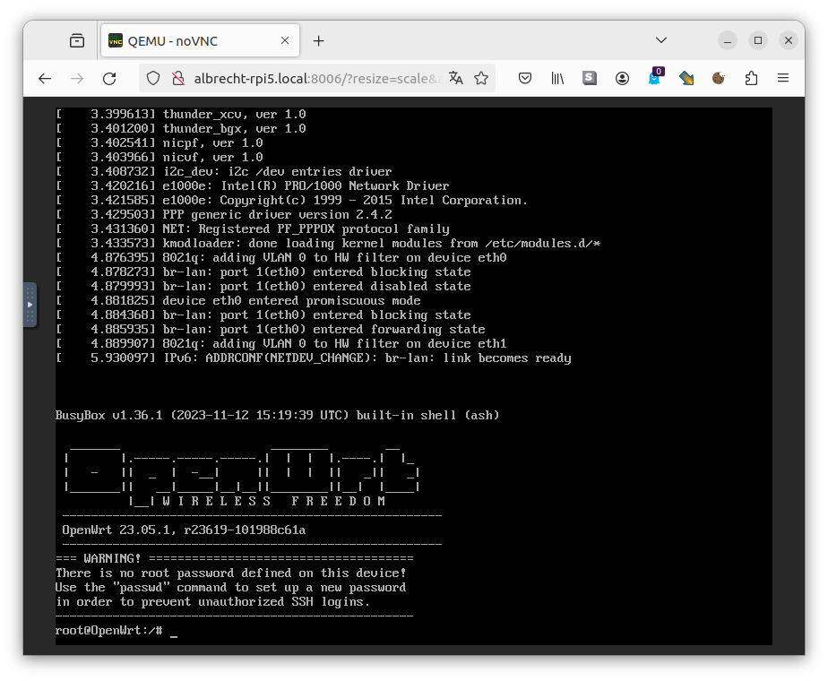
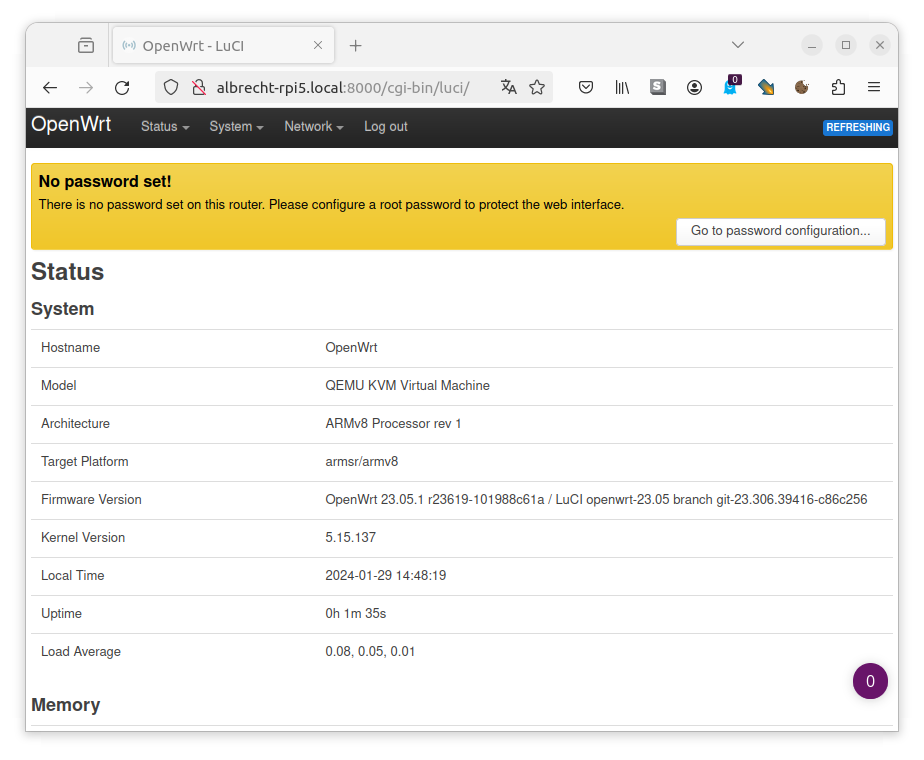

# OpenWrt docker container for x86_64, arm64 and Weidmueller u-OS

[](https://hub.docker.com/r/albrechtloh/openwrt-docker)
[](https://github.com/AlbrechtL/openwrt-docker/actions/workflows/openwrt-stable-build.yml)
[](https://github.com/AlbrechtL/openwrt-docker/actions/workflows/openwrt-master-build.yml)

This Docker container brings you OpenWrt, a software-based router solution, in an easy-to-use setup. Unlike other OpenWrt containers, this one provides a full system emulation, complete with OpenWrt's own Linux kernel. Thanks to powerful technologies like KVM and macvtap, OpenWrt runs at nearly native speeds here. We use the original OpenWrt binary builds, so most features should work seamlessly. If you notice any features that aren’t working as expected, please let us know!

## Features

 - Supports all x86_64 and arm64 Linux based systems
   - x86_64 tested on some Intel and AMD system
   - arm64 tested on a [Raspberry Pi 5](https://www.raspberrypi.com/products/raspberry-pi-5/) and Weidmueller [UC20-M4000](https://eshop.weidmueller.com/en/uc20-m4000/p/2839160000)
 - KVM acceleration
 - Web-based viewer for tty console
 - Attaches two physical Ethernet interfaces (LAN/WAN) exclusively into the docker container
 - Create virtual LAN between OpenWrt and host system (LAN only)
 - USB pass-through e.g. for modem or Wi-Fi
 - Automatic config migration when OpenWrt is updated (experimental)

## Pre-installed OpenWrt software packages

Because OpenWrt doesn't provide a user installed package update mechanism, all required packages needs to be included into the OpenWrt rootfs image. This Docker images add the following software to the OpenWrt rootfs:
 - Luci Web interface
 - ssh server
 - Wi-Fi client and access point support
 - Wireguard
 - mDNS support

### Supported USB devices

 - Mediathek MT7961AU Wi-Fi 6 AX chip-set based devices e.g. (FENVI 1800Mbps WiFi 6 USB Adapter)
 - SIMCOM SIM8262E-M2 based devices (Multi-Band 5G NR/LTE-FDD/LTE-TDD/HSPA+ modem)

## Usage

Adapt [`docker-compose.yml`](https://github.com/AlbrechtL/openwrt-docker/blob/master/docker-compose.yml) to your needs and run `docker compose up`.

Images are available at https://hub.docker.com/r/albrechtloh/openwrt-docker.

Currently, three images are available. For all of these images automated tests are applied.
* `albrechtloh/openwrt-docker:latest` Latest OpenWrt stable version e.g. 24.05.5
* `albrechtloh/openwrt-docker:openwrt-2410-snapshot` Latest OpenWrt 24.10 snapshot version
* `albrechtloh/openwrt-docker:openwrt-master-snapshot` Latest OpenWrt master version

## Screenshots

VNC console in web browser


OpenWrt LUCI web interface


## Platform specific tips and tricks

#### Does it run under MS Windows WSL?
* Yes, but only `LAN_IF="host"` and `WAN_IF="host"` is supported because WSL doesn't support the `macvtab` driver.
* See issue https://github.com/AlbrechtL/openwrt-docker/issues/5 for details.

#### A have a board with two Ethernet ports and I want to use one as OpenWrt LAN and one as OpenWrt WAN without losing the access to the host Linux system.
* The easiest is to add simply a 3rd Ethernet port to the system, e.g. a USB-Ethernet dongle.
* You can also create a bridge in at the host and use the option `LAN_IF: "veth,nofixedip"`. See https://github.com/AlbrechtL/openwrt-docker/issues/8 for details.

#### Which Weidmueller u-OS version is supported?
* You need the u-OS version "u-OS 2.1.1-preview-kvm" to run OpenWrt correctly. Unfortunately, this version is not public available. If you are interested, feel free to fill out the contact form at https://www.weidmueller.com/int/solutions/technologies/edge_computing_u_os/index.jsp.
* This special u-OS version is necessary because we need the `kvm` and `macvtab` driver enabled in the Linux kernel.

#### In the `LAN_IF: "veth"` mode the host virtual Ethernet interface IP address is fixed to 172.31.1.2/24. How can I change it?
You can use the option `nofixedip` e.g. `LAN_IF: "veth,nofixedip"` to avoid that an IP address is set after interface creation. But it is your responsibility to configure the Ethernet interface correctly. The OpenWrt LuCI web interface forwarding is only working correctly when the virtual Ethernet interfaces are configured correctly. Furthermore, the OpenWrt LuCI web interface forwarding is expecting OpenWrt at the IP address 172.31.1.1.


## Build and run
Clone this repo and run
```bash
docker build -t openwrt-docker .
```

If you like to specify a specific OpenWrt version, you can do
```bash
docker build -t openwrt-docker . --build-arg OPENWRT_VERSION="23.05.4"
```
or for the latest development master. The `--no-cache` option is necessary to get always the newest version.
```bash
docker build --no-cache -t openwrt-docker . --build-arg OPENWRT_VERSION="master"
```

## Acknowledgement

I would like to thanks to following Open Source projects. Without these great works this container would not be possible
* [OpenWrt](https://openwrt.org/)
* [QEMU](https://www.qemu.org/)
* [qemu-docker](https://github.com/qemus/qemu-docker)
* [noVNC](https://novnc.com/)
* [Docker](https://www.docker.com/)
* [Alpine Linux](https://www.alpinelinux.org/)

## Disclaimer: Security Notice

This software container is a proof of concept and has not undergone comprehensive cybersecurity assessments. Users are cautioned that potential vulnerabilities may exist, posing risks to system security and data integrity. By deploying or using this container, users accept the associated risks, and the developers disclaim any responsibility for security incidents or data breaches. A thorough security evaluation, including penetration testing and compliance checks, is strongly advised before production deployment. The software is provided without warranty, and users are encouraged to provide feedback for collaborative efforts in addressing security concerns. Users acknowledge reading and understanding this disclaimer, assuming responsibility for ensuring their environment's security.
