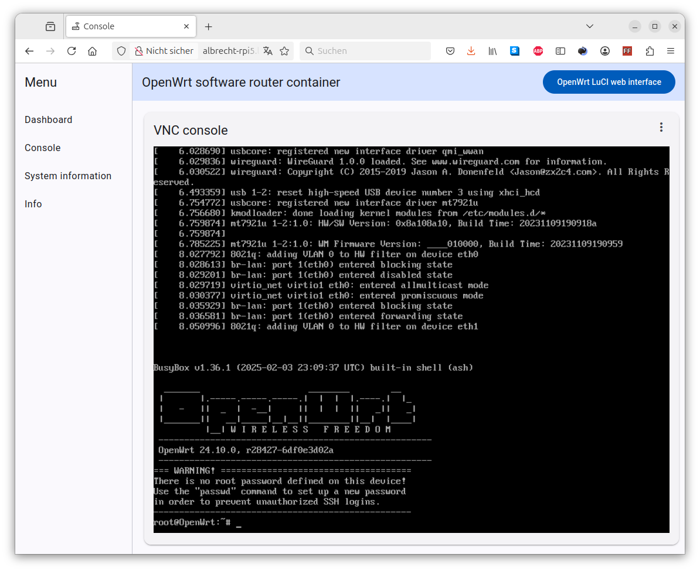

# OpenWrt qemu docker container for arm64

Based on the great works of https://github.com/qemus/qemu-docker. Thanks!

QEMU in a docker container for running arm64 virtual machines. Tested on Raspberry Pi 5.

It uses high-performance QEMU options (like KVM acceleration, kernel-mode networking, IO threading, etc.) to achieve near-native speed.

Images can be found a docker hub https://hub.docker.com/r/albrechtloh/qemu-openwrt

## Features

 - KVM acceleration
 - Web-based viewer for tty console
 - Attaches two physical Ethernet interfaces exclusively into the docker container
 - USB passthrough e.g. for modem or Wi-Fi
 - Automatic config migration when OpenWrt is updated (experimental)

## Usage

See `docker-compose.yml`

## How it works
See `src/entry.sh` and `Dockerfile`

## Build and run

```bash
docker build -t openwrt-docker-arm64 . && docker compose up
```

## Screenshots

VNC console in web browser


OpenWrt LUCI web interface


## Disclaimer: Security Notice

This software container is a proof of concept and has not undergone comprehensive cybersecurity assessments. Users are cautioned that potential vulnerabilities may exist, posing risks to system security and data integrity. By deploying or using this container, users accept the associated risks, and the developers disclaim any responsibility for security incidents or data breaches. A thorough security evaluation, including penetration testing and compliance checks, is strongly advised before production deployment. The software is provided without warranty, and users are encouraged to provide feedback for collaborative efforts in addressing security concerns. Users acknowledge reading and understanding this disclaimer, assuming responsibility for ensuring their environment's security.
